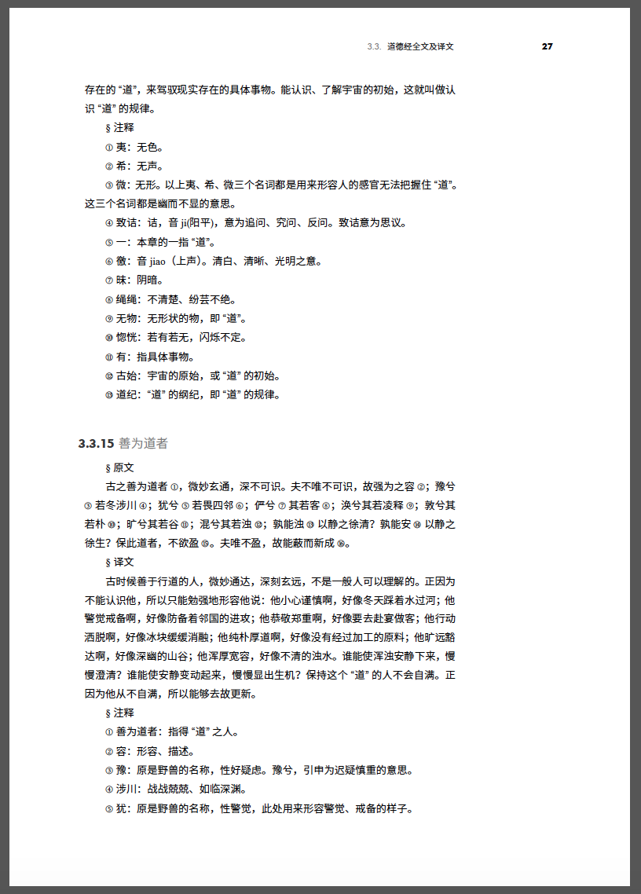

# 《道德经注》

道德经是中国文化的瑰宝，下载《道德经注》[链接](https://github.com/Samurais/book-of-tao/raw/master/docs/book-of-tao.pdf)，学习道德经使人更有智慧。


为了方便学习道德经，我整理了一些网络资料，并加上了自己的一些理解在释义中，排版精美，并贡献排版项目。



# 贡献

本书使用`Markdown`编写，通过`Pandoc`处理为`Tex`文件，然后通过`LaTex`进行排版。

## 依赖

* Linux, Mac OSX

* texlive 2017

```
xelatex -v
XeTeX 3.14159265-2.6-0.99998 (TeX Live 2017)
```

* Pandoc

```
pandoc -v
pandoc 1.19.2.1
Compiled with pandoc-types 1.17.0.4, texmath 0.9, skylighting 0.1.1.4
```

## Docker

安装依赖的过程会花费很长时间，一种更加方便的方式是通过Docker将Markdown构建为PDF。

* 启动

```
./scripts/run.sh
```

同时，通过这种方式也可以跨操作系统。

## 构建

在本地或docker容器中执行

```
./scripts/run.sh
```

构建完成后，得到最新的PDF文件：`dist/main.pdf`。


## 书写

使用编辑器修改`src/`文件夹下的Markdown内容。

# 鸣谢

主要内容来源[www.daodejing.org](https://www.daodejing.org)。


# License (MIT)

Copyright 2019 Hai Liang Wang <hailiang.hl.wang@gmail.com> 

Permission is hereby granted, free of charge, to any person obtaining a copy of this software and associated documentation files (the "Software"), to deal in the Software without restriction, including without limitation the rights to use, copy, modify, merge, publish, distribute, sublicense, and/or sell copies of the Software, and to permit persons to whom the Software is furnished to do so, subject to the following conditions:

The above copyright notice and this permission notice shall be included in all copies or substantial portions of the Software.

THE SOFTWARE IS PROVIDED "AS IS", WITHOUT WARRANTY OF ANY KIND, EXPRESS OR IMPLIED, INCLUDING BUT NOT LIMITED TO THE WARRANTIES OF MERCHANTABILITY, FITNESS FOR A PARTICULAR PURPOSE AND NONINFRINGEMENT. IN NO EVENT SHALL THE AUTHORS OR COPYRIGHT HOLDERS BE LIABLE FOR ANY CLAIM, DAMAGES OR OTHER LIABILITY, WHETHER IN AN ACTION OF CONTRACT, TORT OR OTHERWISE, ARISING FROM, OUT OF OR IN CONNECTION WITH THE SOFTWARE OR THE USE OR OTHER DEALINGS IN THE SOFTWARE.OF


